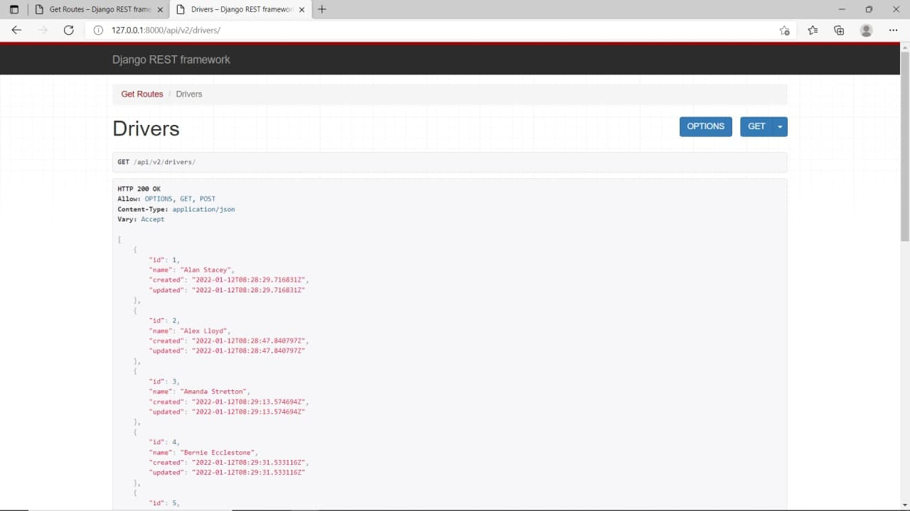
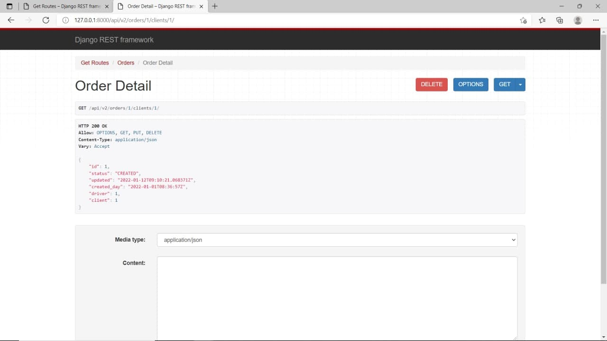
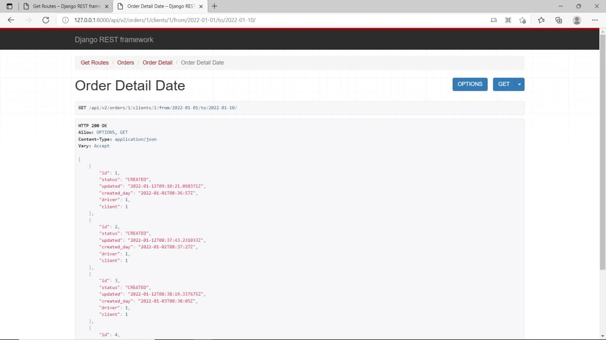

# My Taxi Api v2 | Technical Interview 
Sourcode and Resources for My Taxi Api v2

See the peoject live: https://my-taxi-api-v2.herokuapp.com/

# Installation
* 1 - clone repo https://github.com/Muhammadali-Akbarov/my-taxi-api-v2.git
* 2 - create a virtual environment and activate
*  - pip install virtualenv
*  - virtualenv envname
*  - envname\scripts\activate
* 3 - cd into project "cd my-taxi-api-v2"
* 4 - pip install -r requirements.txt
* 5 - python manage.py runserver

# Features
* Info about Drivers such as JSON
* Info about Clients such as JSON
* GET,PUT,DELETE methods

# Completed with
* Django 
* Database Design and Models with MySQL
* Building an API with Django REST Framework (DRF)
* Deployment

# Methods GET & POST

# Methods GET,POST & PUT

# Methods GET,POST & PUT.
  

